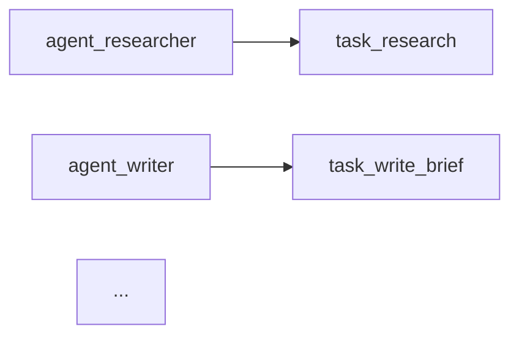

# Agent OS Flagship Example

One runnable story wiring three layers of the [Agent OS](https://github.com/cdzzy) stack together:

| Layer | Package | Role in this example |
|-------|---------|---------------------|
| Kernel | [agent-kernel](https://github.com/cdzzy/agent-kernel) | Schedules a `researcher → writer → reviewer` pipeline with dependencies, priorities, and token budgets |
| Audit | [traceshield](https://github.com/cdzzy/traceshield) | Every task, budget overrun, and deadlock lands in a hash-chain-verified trace log |
| Memory | [engram](https://github.com/cdzzy/engram) | The three agents share findings through long-term memory instead of passing blobs around |

## Run it

```bash
npm install
npm start
```

You'll see:

1. **Shared memory** — the findings, draft, and review stored by each agent
2. **Audit trail** — every kernel task traced with hash-chain integrity verification
3. **Attribution graph** — the whole run rendered as a Mermaid diagram (paste it into any Markdown viewer):



4. **A live budget violation** — the writer blows its token budget, which flows into the audit trail as a `StoredViolation` via the [kernel ↔ traceshield bridge](https://github.com/cdzzy/agent-kernel).

## The Python half of the stack

The Agent OS suite also includes Python layers:

- [agentconfig](https://github.com/cdzzy/agentconfig) — business-language agent configuration with LLM-as-judge constraints
- [agentlink](https://github.com/cdzzy/agentlink) — inter-agent messaging (WebSocket, A2A, streaming, DLQ)
- [agenttest](https://github.com/cdzzy/agenttest) — agent testing framework with a pytest plugin

Because agentlink speaks A2A and WebSocket, the TypeScript and Python halves interoperate: a Python agentlink node can join this kernel's fleet, and agentconfig constraints can gate the same tasks agenttest verifies.
